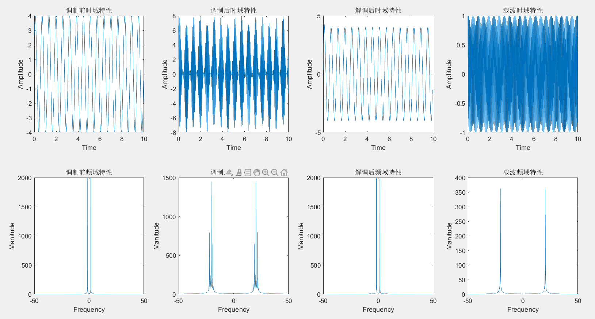

# 一、实验内容

根据线性调制中几种方法。以单频正弦信号为调制信号，仿真实现线性调制。并分析调制前后的时域、频域统计特征。基于仿真画出相应的图。

# 二、实验思路

已知调制信号 $mp$ ，载波信号 $c$，载波信号的频率 $w_0$ 是调制信号频率 $w$ 的50倍

首先画出 $mp$ 的时域和频域图，画频域图需要对 $mp$ 做傅里叶变换， fftshift 通过将零频分量移动到数组中心，重新排列傅里叶变换 

接着进行调制

先将调制信号整体增大至没有负幅值，需要加上 $abs(min(mp))$，得到信号 $m$ 

AM调制：已调信号 $s=c*m$ 

接着画出 $s$ 的时域和频域图

再进行相干解调

需将信号 $z=s*c$ 进行低通滤波，保留的频道为 $0-\dfrac{w}{2\pi} Hz$ 

解调后的信号 $sp=2*z-abs(min(mp))$ 

接着画出 $sp$ 的时域和频域图

最后画出载波的时域和频域图

# 三、结果

